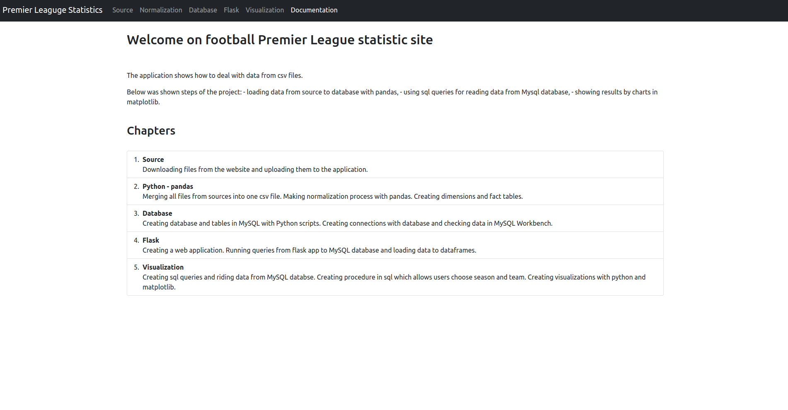
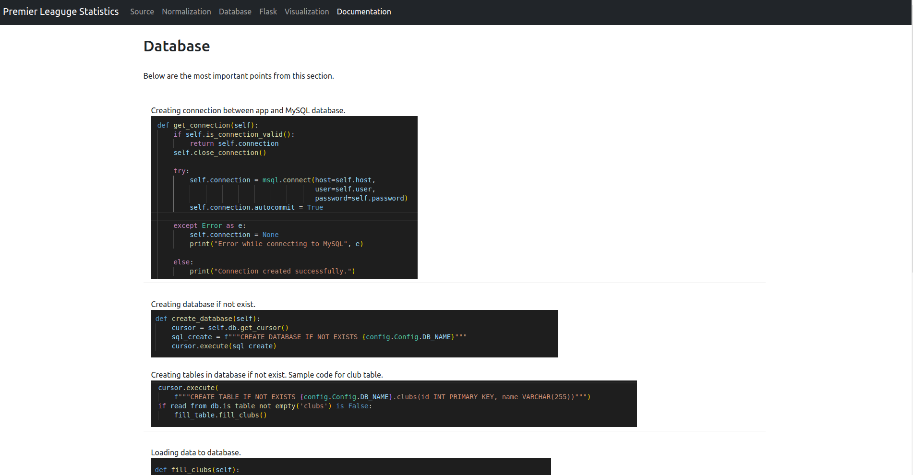

# Football Premier League Stats Application
> This application shows the process of data flow from the source to visualizations. 


## Table of Contents
* [General Info](#general-information)
* [Technologies Used](#technologies-used)
* [Features](#features)
* [Screenshots](#screenshots)
* [Setup](#setup)
* [Usage](#usage)
* [Project Status](#project-status)
* [Room for Improvement](#room-for-improvement)
* [Contact](#contact)

## General Information
- This project was created because I wanted to learn how to normalize data.
- I wanted to create sample of ETL process with data visualization.


## Technologies Used
- Python - version 3.10.6
- Flask - version 2.2.2
- Pandas - version 1.5.3
- Matplotlib - version 3.7.1

## Features
List the ready features here:
- Marging downloaded files into one csv file,
- Normalization in pandas and creating dimensions and facts tables,
- Making connection with mysql database in python app,
- Creating database and tables with python scripts,
- Loading data to tables in database with python scripts,
- Creating reader data,
- Creating SQL queries,
- Creating Flask app to show project steps and results,
- Reading .sql files and creating dataframes with pandas,
- Creating sql procedure and sql queries,
- Creating visualizations in matplotlib and showing results on flask app,
- Creating dockerfile and docker compose and next delpoying image on dockerhub.

## Screenshots






## Setup
For starting application with docker you need [Docker](https://docs.docker.com/get-docker/) and [docker-compose](https://docs.docker.com/compose/install/).


## Usage
The application can be built from sources or can be run in docker.

##### Build from sources
```bash
$ # Move to directory
$ cd folder/to/clone-into/
$
$ # Clone the sources
$ git clone https://github.com/mateuszgua/football-stats-england.git
$
$ # Move into folder
$ cd football-stats-england
$
$ # Create virtual environment
$ python3 -m venv my_env
$
$ # Activate the virtual environment
$ source my_env/bin/activate
$
$ # Install requirements.txt file
$ pip install -r requirements.txt
$
$ # Start app
$ flask --app app.py run
$ # ...
$ # * Running on http://127.0.0.1:5000 
```

##### Start the app in Docker
```bash
$ # Move to directory
$ cd folder/to/clone-into/
$
$ # Clone the sources
$ git clone https://github.com/mateuszgua/football-stats-england.git
$
$ # Move into folder
$ cd football-stats-england
$
$ # Start app
$ docker-compose up --build
$ # ...
$ # frontend_1  |  * Running on http://127.0.0.1:5000
```

##### Copy image from DockerHub
An Image has been created for the application, the image pushed on [DockerHub](https://hub.docker.com/repository/docker/mateuszgua/football-stats-app/general).
```bash
$ # Get image from dockerhub
$ docker pull mateuszgua/football-stats-app:slim1
$
$ # Rename image
$ docker image tag mateuszgua/football-stats-app:latest football-stats-app:latest
$
$ # Delete old image
$ docker rmi mateuszgua/football-stats-app
$
$ # Create network
$ docker network create mynetwork
$
$ # Run mysql container
$ docker run --rm --name mysql-container --network mynetwork -e MYSQL_ROOT_PASSWORD=root -e MYSQL_DATABASE=football_eng -d mysql:8.0
$
$ # Run app container
$ docker run --rm --name football-stats-app --network mynetwork -p 5000:5000 football-stats-app:latest
```

## Project Status
Project is: completed


## Room for Improvement
Room for improvement:
- deploy project on server

## Contact
Created by [@DevGua]() - feel free to contact me!
